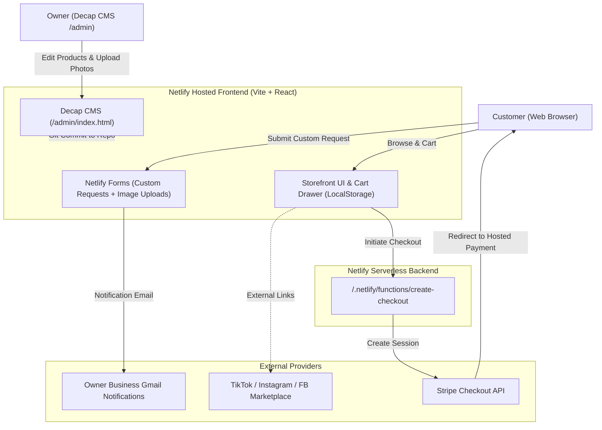

# Weebles Hand-Sculpted Polymer Clay Figurines Web Store — Design Specification

**Date:** 2026-10-07  
**Project Name:** Weebles Web Store  
**Target Platform:** Netlify (Static SPA + Netlify Functions + Netlify Forms + Decap CMS)

---

## 1. Overview & Vision
Weebles is an artisan e-commerce storefront for handcrafted, hand-sculpted, and hand-painted polymer clay figurines sold primarily as refrigerator magnets and keychains (with optional desk figurine / collector display pieces). 

The store caters to lovers of cute, miniature aesthetics with a **Hello Kitty / pastel pop aesthetic**: warm strawberry milk pinks, lavender blush, baby powder blues, butter yellows, rounded bubble lettering, and playful jelly-pill buttons.

The site is optimized for:
1. **Anonymous exploration & shopping**: No user login required to browse, customize variants, or checkout.
2. **Interactive product catalog**: Small, high-information cards with instant variant switching (Magnet vs. Keychain) and real-time stock indication.
3. **Cart & Seamless Stripe Payments**: Full add/remove/edit cart persisted in `localStorage`, sliding out as a drawer, routing through Netlify Functions into Stripe Checkout.
4. **Custom Order & Contact Channel**: Netlify Form supporting reference photo attachments for bespoke customer figurine requests, delivering inquiries straight to the owner's business Gmail.
5. **Decap CMS Content Management**: Free web admin portal (`/admin`) allowing the shop owner to upload photos, adjust prices, edit descriptions, and manage stock status directly from their phone or laptop without writing code.
6. **Social Media Exposure Interlinking**: Integrated hubs for TikTok (making process & ASMR sculpting clips), Instagram (photo gallery & customer tags), and Facebook Marketplace (regional exposure).

---

## 2. Visual Design & Aesthetic System

### 2.1 Color Palette
* **Brand / Strawberry Milk Pink:** `#FF85A1` (Primary actions, accent borders, cart count badge)
* **Soft Background Wash:** `#FFF5F7` to `#FFF0F5` (Lavender blush gradient, clean and soft)
* **Pillow Card Surface:** `#FFFFFF` with `#FFE4EC` subtle borders
* **Accent Pastels:**
  * Baby Powder Blue: `#BCE7FD` (Tag badges & keychain highlights)
  * Butter Yellow: `#FFF1A8` (Stars, badges, discounts, alerts)
  * Mint Green: `#C1F0DC` (In-stock indicator, successful cart actions)
  * Soft Lilac: `#E6D7FF` (Category chips & secondary tags)
* **Typography Colors:**
  * `#4A2E35` (Deep Berry Chocolate — soft on the eyes, avoids harsh pitch-black)
  * `#7A5C61` (Warm Rose Taupe — secondary body text and metadata)

### 2.2 Typography
* **Display / Headings / Logo:** `Fredoka` (Google Fonts) — friendly, rounded, bubble cartoon lettering with subtle soft dropshadows.
* **Body / Interface:** `Quicksand` (Google Fonts) — legible, warm, rounded geometric sans-serif.

### 2.3 Tactile & Micro-Interactions
* **Corners:** Heavy rounding (`rounded-3xl` / 24px) for all cards, modals, and container elements.
* **Borders:** Soft, thick cartoon border styling (`border-3 border-pink-200`).
* **Shadows:** Floating "pillow" glow shadows (`shadow-[0_8px_25px_rgba(255,133,161,0.18)]`).
* **Micro-Animations:** Jelly bounce hover effects (`hover:scale-105 active:scale-95 transition-all`), floating cute stickers (sparkles ✨, strawberries 🍓, hearts 💖, bows 🎀).

---

## 3. Information Architecture & Key Components

### 3.1 Global Navigation (`Navbar.tsx`)
* **Logo:** "Weebles" written in bubbly custom cartoon typography with a miniature clay mascot icon.
* **Navigation Links:**
  * `Catalog` (smooth scroll or view switch)
  * `Custom Requests 💌` (opens custom order modal/section)
  * `About & Care` (polymer clay care instructions)
* **Social Shortcuts:** Quick icons for TikTok, Instagram, and Facebook Marketplace.
* **Cart Badge:** Bouncy pink pill button displaying cart icon and live item counter.

### 3.2 Hero Banner (`HeroBanner.tsx`)
* Playful headline: *"Tiny Friends for Your Fridge & Keys ✨"*
* Tagline highlighting hand-sculpted quality, non-toxic polymer clay, and durable UV resin glaze.
* Cute action pills: `"Explore Available Stock 🍓"` and `"Request Custom Weeble 🎀"`.

### 3.3 Product Catalog & Card System (`CatalogGrid.tsx` & `ProductCard.tsx`)
* **Filter Pills:**
  * All Weebles
  * 🧲 Refrigerator Magnets
  * 🔑 Keychains
  * 🍓 New Arrivals
  * 🎀 Under $15
* **Product Card Anatomy:**
  * **Aspect Ratio:** Square image container with curved corners and smooth hover zoom.
  * **Stock Badge:** Overlay badge (`✨ In Stock`, `🍓 Only 1 Available!`, or `💤 Sold Out`).
  * **Title & Sub-info:** Name of the figurine, clay type, and protective glaze description.
  * **Variant Switcher:** Quick buttons:
    * `[ 🧲 Magnet ]` (strong neodymium magnet embedded into back)
    * `[ 🔑 Keychain ]` (pastel bead charm & sturdy swivel clasp)
  * **Pricing:** Formatted price (e.g., `\$14.00`).
  * **Add to Cart CTA:** Bouncy button that updates cart quantity, provides visual feedback (heart burst animation), and triggers the cart drawer.

### 3.4 Persistent Shopping Cart Drawer (`CartDrawer.tsx`)
* **Trigger:** Clicked via navigation bar or automatically opened on "Add to Cart".
* **Drawer State:** Slides from the right; background overlay blurs slightly.
* **Items Displayed:**
  * Thumbnail, title, chosen variant tag (`🧲 Magnet` or `🔑 Keychain`).
  * Individual price and quantity adjuster (`-` / `+`).
  * Trash icon for instant removal.
* **Order Summary:**
  * Subtotal calculation.
  * Shipping notice (e.g., standard flat rate or free shipping threshold banner).
  * Sweet personalized gift note input field.
* **Checkout Button:**
  * High-visibility strawberry pink button: *"Proceed to Checkout with Stripe 💖"*.
  * Invokes Netlify Function, redirects to Stripe Hosted Checkout.

### 3.5 Custom Figurine Request Form (`CustomOrderModal.tsx`)
* Powered by **Netlify Forms** (`data-netlify="true"` with `enctype="multipart/form-data"`).
* Fields:
  1. Customer Full Name
  2. Customer Email (for direct quote reply)
  3. Desired Finish (Refrigerator Magnet, Keychain, Both, or Desk Figurine)
  4. Character / Concept Description (colors, animals, facial expression, accessories like hats/strawberries)
  5. Reference Photo Upload (`accept="image/*"` for sketches, pet photos, or color swatches)
  6. Estimated Deadline / Notes
* Submission triggers a friendly confirmation card with a cute response time notice (24-48 hours).

### 3.6 Social Media Exposure Strip (`SocialStrip.tsx`)
* Prominent banner celebrating the creative process:
  * **TikTok:** *"Watch how Weebles are made! ASMR sculpting & packaging orders on TikTok @weebles_clay"*
  * **Instagram:** *"Join our community for restock countdowns & cute customer photos @weebles_clay"*
  * **Facebook Marketplace:** *"Shop local stock & regional drop events on Facebook Marketplace"*

### 3.7 Decap CMS Content Management (`public/admin/`)
* Static files:
  * `public/admin/index.html`: Decap CMS loader script.
  * `public/admin/config.yml`: Collection configuration pointing to `src/data/products.json` or individual markdown/json product files.
* Allows the owner to authenticate via Netlify Identity or GitHub and manage listings without touching code.

---

## 4. Technical Architecture & Data Flow



### 4.1 Data Models

#### Product Entity (`src/types/index.ts`)
```typescript
export interface Product {
  id: string;
  name: string;
  description: string;
  price: number; // In USD, e.g. 14.00
  images: string[];
  category: 'animals' | 'sweets' | 'fantasy' | 'mini-friends';
  availableVariants: ('magnet' | 'keychain')[];
  inStock: boolean;
  stockCount: number;
  featured?: boolean;
  isOneOfAKind?: boolean;
}
```

#### Cart Item Entity
```typescript
export interface CartItem {
  id: string;
  productId: string;
  name: string;
  variant: 'magnet' | 'keychain';
  price: number;
  image: string;
  quantity: number;
}
```

### 4.2 Stripe Checkout Netlify Function
* **Path:** `netlify/functions/create-checkout.ts`
* **Handler:**
  1. Receives array of `CartItem` objects and optional customer note.
  2. Validates items against product pricing catalog.
  3. Formats line items for the Stripe Checkout Sessions API:
     * Product name includes variant: e.g. *"Strawberry Bunny Weeble (Refrigerator Magnet)"*.
     * Images, unit amount (in cents), quantity.
  4. Configures `success_url` (`https://<domain>/order-success?session_id={CHECKOUT_SESSION_ID}`) and `cancel_url` (`https://<domain>/cart`).
  5. Returns `{ url: session.url }` to client for automatic redirection.

---

## 5. Deployment & Configuration Checklist

1. **Netlify Account Setup**:
   * Connect Git repository to Netlify.
   * Build command: `npm run build`
   * Publish directory: `dist`
2. **Environment Variables on Netlify**:
   * `STRIPE_SECRET_KEY`: Stripe API secret key.
   * `STRIPE_PUBLISHABLE_KEY`: Public key for client-side helpers if needed.
   * `URL`: Site URL for Stripe return redirects.
3. **Netlify Forms Setup**:
   * Enable form notifications in Netlify Dashboard: Settings > Forms > Form notifications > Email notification (configure owner's business Gmail).
4. **Decap CMS Setup**:
   * Enable Netlify Identity in Netlify Dashboard.
   * Enable Git Gateway under Identity > Services.

---

## 6. Success Criteria
* [x] Anonymous visitors can smoothly browse products, filter by category, and inspect detailed figurine cards.
* [x] Customers can toggle between Magnet and Keychain variants seamlessly on each item card.
* [x] Shopping cart supports adding, editing quantity, and removing items, stored reliably across sessions in `localStorage`.
* [x] Checkout connects securely to Stripe via Netlify Functions without exposing secret keys.
* [x] Custom order requests with photo attachments submit directly via Netlify Forms to owner's Gmail.
* [x] Direct clickable links and branding for TikTok, Instagram, and Facebook Marketplace.
* [x] Visual aesthetic reflects the requested soft pastel pink, Hello Kitty feminine cartoon charm.
