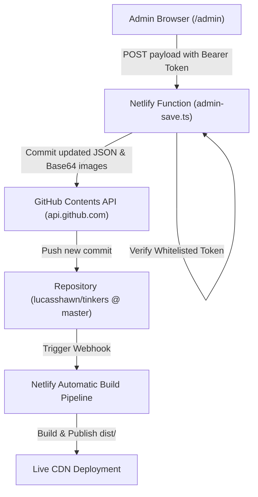

# Weebles Studio Admin Portal & Google SSO — Design Specification

**Date:** 2026-10-08  
**Feature:** Administrative Portal with Google SSO & Git-Backed Settings / Inventory Management  
**Target Platform:** Netlify (SPA + Netlify Serverless Functions + GitHub API)

---

## 1. Overview & Objectives
The goal of the Weebles Studio Admin Portal is to give the business owners (`lucasshawn@gmail.com` and `lucascierra24@gmail.com`) a secure, bespoke, and delightful administrative interface to manage the store from any browser or phone without editing code.

Key capabilities:
1. **Google SSO Authentication**:
   - Locked down behind official Google Identity Services sign-in.
   - Strict serverless verification restricting access solely to the two authorized admin Gmail accounts:
     - `lucasshawn@gmail.com`
     - `lucascierra24@gmail.com`
2. **Inventory & Product Management**:
   - Browse all catalog figurines in a clean table/grid.
   - Add new Weebles (title, description, price, category, variants, stock status).
   - Edit existing items (update prices, edit descriptions, adjust stock counts).
   - Upload and manage product photos (persisted into `public/images/products/`).
   - Remove/delete items with confirmation safeguards.
3. **Storefront & Social Configuration**:
   - Configure general contact email address (used across footer, about section, FAQ).
   - Configure custom order request recipient email (used for quote notifications).
   - Update social media links for **TikTok**, **Instagram**, and **Facebook Marketplace**.
   - Initial defaults pre-populated from current live site settings.
4. **Git-Backed Persistence (Zero Database)**:
   - All changes (inventory, settings, and uploaded images) are committed directly to the GitHub repository (`lucasshawn/tinkers` on `master`) via Netlify Function (`/.netlify/functions/admin-save`).
   - Pushing commits to GitHub triggers Netlify's automatic build and deployment pipeline in ~15-20 seconds.
5. **Brand Aesthetic Continuity**:
   - Styled to match the Weebles Hello Kitty pastel palette (soft pinks, baby blues, butter yellows, rounded Fredoka headings, Quicksand body font, and pillow drop shadows).

---

## 2. Authentication & Access Control Architecture

### 2.1 Google Identity Services (GIS) Client Flow
1. **GIS Script Loader:**
   - The `/admin` portal loads Google Identity Services script `https://accounts.google.com/gsi/client`.
   - Initializes Google One Tap / Button with `VITE_GOOGLE_CLIENT_ID` (or environment fallback).
2. **Client Login:**
   - User clicks **"Sign in with Google"**.
   - Google opens the account chooser and returns a cryptographically signed Google ID token (JWT) containing the user's Google profile and email.
3. **Backend Token Verification (`netlify/functions/admin-auth.ts`):**
   - The frontend sends `{ credential }` to `POST /.netlify/functions/admin-auth`.
   - The function verifies the token signature against Google's public keys via Google's tokeninfo API or `google-auth-library`.
   - Extracts the verified `email`.
4. **Strict Whitelist Authorization:**
   ```typescript
   const ALLOWED_ADMIN_EMAILS = [
     'lucasshawn@gmail.com',
     'lucascierra24@gmail.com'
   ];
   ```
   - If `ALLOWED_ADMIN_EMAILS.includes(verifiedEmail)` is false:
     - Return `403 Forbidden` (`{ error: 'Unauthorized: Account not in admin whitelist' }`).
   - If true:
     - Generate a signed HMAC session token (`{ email, exp, role: 'admin' }`) using `ADMIN_SESSION_SECRET` (configured in Netlify environment variables, with a secure default for dev).
     - Return `200 OK` with `{ token, email, name, picture }`.
5. **Local Development Bypass:**
   - If running locally without a `VITE_GOOGLE_CLIENT_ID` configured, display a clearly marked "Development Studio Login" button that signs in as `lucasshawn@gmail.com` for rapid offline testing.

---

## 3. Data Models & Storefront Configuration

### 3.1 Store Settings Model (`src/data/settings.json`)
```json
{
  "contactEmail": "weeblesclay@gmail.com",
  "customOrderEmail": "weeblesclay@gmail.com",
  "socials": {
    "tiktok": "https://tiktok.com/@weebles_clay",
    "instagram": "https://instagram.com/weebles_clay",
    "facebookMarketplace": "https://facebook.com/marketplace"
  }
}
```

### 3.2 Dynamic Integration (`SettingsContext.tsx`)
A new `SettingsProvider` and `useSettings()` hook will wrap the application:
- Provides `settings: SiteSettings` and `updateSettings: (newSettings: SiteSettings) => Promise<void>`.
- Components (`Navbar.tsx`, `Footer.tsx`, `SocialStrip.tsx`, `CustomOrderModal.tsx`) consume these values dynamically instead of hardcoded strings.
- Guaranteed fallback to current defaults if `settings.json` is missing or incomplete.

### 3.3 Inventory Catalog Model (`src/types/index.ts`)
Uses the existing, battle-tested `Product` schema:
```typescript
export interface Product {
  id: string;
  name: string;
  description: string;
  price: number;
  images: string[];
  category: 'animals' | 'sweets' | 'fantasy' | 'mini-friends';
  availableVariants: ('magnet' | 'keychain')[];
  inStock: boolean;
  stockCount: number;
  featured?: boolean;
  isOneOfAKind?: boolean;
}
```

---

## 4. Admin Portal UI Structure (`src/components/admin/`)

### 4.1 Routing & Navigation
* Accessible at route `/admin`.
* A discreet link is placed in `Footer.tsx`: `"Studio Login 🍓"`.
* If unauthenticated, displays the **AdminLoginCard** with Google SSO button.
* If authenticated, displays the full **AdminDashboard**.

### 4.2 Dashboard Layout
1. **Top Header**:
   - Weebles Strawberry brand mark.
   - Authenticated user pill: avatar + `lucasshawn@gmail.com`.
   - "Back to Storefront 🌸" link.
   - "Log Out" button (clears session token).
2. **Navigation Tabs**:
   - **`[ 🍓 Inventory & Catalog ]`**
   - **`[ ⚙️ Store & Social Settings ]`**

### 4.3 Tab 1: Inventory & Catalog Management
* **Action Bar**:
  - Filter by category (`All`, `Critters`, `Sweets`, `Fantasy`, `Mini-Friends`).
  - Search by name or description.
  - Count badge: e.g. `6 Weebles active (2 out of stock)`.
  - **`+ Add New Weeble`** primary button.
* **Product Listing Cards / Table**:
  - Image thumbnail.
  - Name, category badge, and formatted price (`$14.00`).
  - Status pills (`✨ In Stock (2)`, `⭐ 1-of-1 Original`, `💤 Sold Out`).
  - Variant pills (`🧲 Magnet`, `🔑 Keychain`).
  - Actions:
    - `✏️ Edit`: Opens the Weeble Editor Drawer.
    - `🗑️ Delete`: Opens a cute confirmation modal (*"Are you sure you want to remove Strawberry Bunny from the catalog?"*).
* **Weeble Editor Drawer / Modal**:
  - Name, Category dropdown, and Price input.
  - Description textarea.
  - **Photo Manager**:
    - Current image preview.
    - File upload input (`accept="image/*"`) for uploading new figurine photos directly from phone/laptop.
    - Optional image URL text input.
  - Variant Checkboxes: `🧲 Refrigerator Magnet`, `🔑 Keychain`.
  - Stock Controls:
    - `In Stock` checkbox toggle.
    - `Stock Count` numeric stepper.
    - `1-of-1 Original Piece` checkbox.
    - `Featured on Homepage` checkbox.
  - Save button with loading indicator.

### 4.4 Tab 2: Store & Social Settings
* **General Inquiries & Emails**:
  - "Contact Email": Updates email shown in footer and clay care guide.
  - "Custom Order Email": Updates recipient for Netlify form notifications.
* **Social Media Accounts**:
  - TikTok URL input (e.g. `https://tiktok.com/@weebles_clay`).
  - Instagram URL input (e.g. `https://instagram.com/weebles_clay`).
  - Facebook Marketplace URL input (e.g. `https://facebook.com/marketplace`).
* **Publish Action**:
  - **"Save & Publish to Store 💖"** button.
  - Displays instant commit & deploy status alert: *"Saved! Netlify is updating the live site."*

---

## 5. Git-Backed Persistence Engine (`netlify/functions/admin-save.ts`)



### 5.1 Request Payload
```typescript
interface AdminSavePayload {
  type: 'inventory' | 'settings';
  products?: Product[];
  settings?: SiteSettings;
  newImage?: {
    filename: string;
    base64Data: string; // Image binary encoded as Base64
  };
}
```

### 5.2 Serverless Implementation
1. Validates the `Authorization: Bearer <token>` header.
2. If `GITHUB_TOKEN` is present in Netlify environment variables:
   - Fetches current file SHA via GitHub API: `GET /repos/{owner}/{repo}/contents/{path}`.
   - If `newImage` is provided:
     - Commits image binary directly to `public/images/products/{filename}` via GitHub Contents API.
   - Commits updated `src/data/products.json` or `src/data/settings.json` with commit message:
     `"chore(admin): update ${type} via studio admin portal"`.
   - Returns `{ success: true, commitSha, message: 'Changes committed to GitHub. Netlify deploy triggered.' }`.
3. If running locally without `GITHUB_TOKEN`:
   - Writes directly to the filesystem (`src/data/products.json`, `src/data/settings.json`, `public/images/products/`).
   - Returns `{ success: true, devMode: true, message: 'Changes saved locally in development mode.' }`.

---

## 6. Netlify Configuration & Environment Variables

To activate Google SSO and GitHub persistence in production, the user configures the following in Netlify:
* `VITE_GOOGLE_CLIENT_ID`: Google OAuth 2.0 Web Client ID from Google Cloud Console.
* `GITHUB_TOKEN`: GitHub Personal Access Token (classic with `repo` scope, or fine-grained with read/write on contents) for pushing updates.
* `GITHUB_REPO`: `lucasshawn/tinkers` (default).
* `GITHUB_BRANCH`: `master` (default).
* `ADMIN_SESSION_SECRET`: Secret key for signing admin session tokens.

---

## 7. Success Criteria
* [x] Admin portal accessible at `/admin` and through discreet "Studio Login 🍓" link in footer.
* [x] Access strictly locked to Google SSO accounts matching `lucasshawn@gmail.com` and `lucascierra24@gmail.com`.
* [x] Non-whitelisted Google accounts are rejected with 403 Forbidden.
* [x] Administrators can add new figurines, edit prices, descriptions, categories, variants, and stock.
* [x] Administrators can upload product photos and delete catalog items.
* [x] Administrators can edit the contact email, custom order recipient email, and TikTok/Instagram/Facebook Marketplace URLs.
* [x] Changes are saved via Netlify Functions directly into GitHub repository, triggering live Netlify deployment.
* [x] Theme maintains the cohesive Hello Kitty pastel feminine aesthetic.
